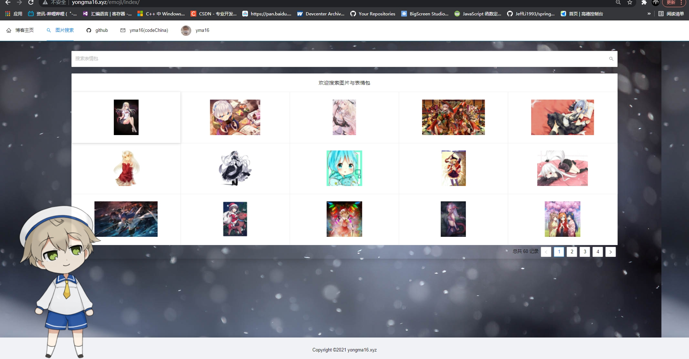

# sticker
表情包搜索网站
技术选型：
前端：vue+antd
后端：django (爬取百度的图片搜索)

http://yongma16.xyz/emoji/index/
# 预览


## Project setup
```
yarn install
```

### Compiles and hot-reloads for development
```
yarn serve
```

### Compiles and minifies for production
```
yarn build
```

### Lints and fixes files
```
yarn lint
```

### Customize configuration
See [Configuration Reference](https://cli.vuejs.org/config/).


